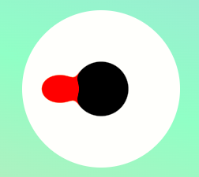
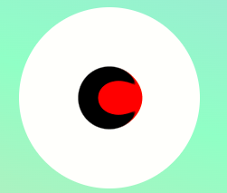
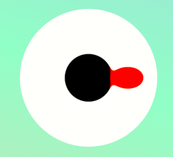

# 样式穿透

在 vue 的 style 中使用 scoped 后，样式就只能对这一个组件生效，但是当使用一些 ui 组件的某些组件后，主要是弹窗之类的，会把 dom 元素直接插入到 body 下或者当前组件外部，此时想要修改其样式就不行了，虽然代码是写在当前这个组件中，但是 dom 却不属于这个组件，此时想要修改这些组件的样式，就只能使用样式穿透，或者在没有 scoped 的 style 中修改，但这样会有样式冲突的风险，因为这样是全局修改

```css
/* 类名son为不属于当前组件的dom */

/* 纯css，使用 >>>  */
.parent >>> .son {}

/* less或sass，在vue2中使用 /deep/或::v-deep */
.parent {
  /deep/ .son {}
}
.parent {
  ::v-deep .son {}
}

/* less或scss，在vue3中使用 :deep或::v-deep */
.parent {
  :deep(.son) {}
}
.parent {
  ::v-deep(.son) {}
}
```

# css3 动画

## 粘滞加载效果
```html
<style>
  body {
    height: 1000px;
    position: relative;
    background: linear-gradient(
      20deg,
      rgb(255, 186, 186),
      rgb(187, 255, 187),
      rgb(172, 172, 255)
    );
  }
  .bigb {
    position: absolute;
    top: 0;
    left: 0;
    right: 0;
    bottom: 0;
    width: 200px;
    height: 200px;
    border-radius: 50%;
    margin: auto;
    background-color: #fff;
    /* 设置对比度，配合blur可设置粘滞效果 */
    filter: contrast(10);
  }
  .smallb {
    position: absolute;
    top: 0;
    left: 0;
    right: 0;
    bottom: 0;
    width: 70px;
    height: 70px;
    border-radius: 50%;
    margin: auto;
    background-color: #000;
    /* 设置高斯模糊，配合contrast可设置粘滞效果 */
    filter: blur(5px);
  }
  .ball {
    position: absolute;
    top: 0;
    bottom: 0;
    margin: auto;
    width: 50px;
    height: 50px;
    border-radius: 50%;
    margin: auto;
    background-color: red;
    filter: blur(5px);
    /* 动画 */
    animation: move 2s linear infinite;
  }
  /* 帧动画 */
  @keyframes move {
    0% {
      left: 5px;
      width: 50px;
      height: 35px;
    }
    25% {
      left: 80px;
      width: 40px;
      height: 45px;
    }
    50% {
      left: 145px;
      width: 50px;
      height: 30px;
    }
    75% {
      left: 70px;
      width: 45px;
      height: 40px;
    }
    100% {
      left: 5px;
      width: 50px;
      height: 35px;
    }
  }
</style>

<body>
  <div class="bigb">
    <div class="smallb"></div>
    <div class="ball"></div>
  </div>
</body>
```

效果如下图：





**设置粘滞效果时，背景一定要用纯色，不要带透明度那些，否则会有模糊效果**


## 水球加载
<style>
  *{
    /* 初始化 取消页面内外边距 */
    margin: 0;
    padding: 0;
  }
  body{
    /* 100%窗口高度 */
    height: 100vh;
    /* 渐变背景 */
    background: linear-gradient(to bottom,#89f7fe,#66a6ff);
  }
  .wave{
    width: 200px;
    height: 200px;
    background-color: #2797e7;
    border-radius: 50%;
    position: absolute;
    left: 50%;
    top: 50%;
    transform: translate(-50%,-50%);
    box-shadow: 0px 0px 50px rgba(255,255,255,0.2);
    /* 溢出隐藏 */
    overflow: hidden;
  }
  .wave::before{
    content: "";
    width: 300px;
    height: 300px;
    background-color: rgba(255,255,255,0.8);
    position: absolute;
    left: 50%;
    top: 0;
    transform: translate(-50%,-65%);
    border-radius: 40%;
    /* 执行动画：动画名称 时长 线性的 无限次播放 */
    animation: wave 5s linear infinite;
  }
  .wave::after{
    content: "加载中...";
    position: absolute;
    left: 50%;
    top: 0;
    transform: translate(-50%,40px);
    color: #2797e7;
  }

  /* 定义动画 */
  @keyframes wave{
    100%{
      transform: translate(-50%,-65%) rotate(360deg);
    }
  }
</style>
<body>
  <div class="wave"></div>
</body>

## 旋转条加载
```html
<style>
  body {
    height: 100vh;
    background: linear-gradient(20deg, #ffbaba, #bbffbb, #acacff);
    display: flex;
    align-items: center;
    justify-content: center;
  }
  .wrap {
    width: 200px;
    height: 200px;
    /* border: 1px solid #fafafa; */
    position: relative;
    display: flex;
    justify-content: center;
    align-items: center;
  }
  .wrap div {
    border-width: 5px;
    border-style: solid;
    border-top-color: transparent;
    border-bottom-color: transparent;
    border-left-color: #fff;
    border-right-color: #fff;
    position: absolute;
  }
  .wrap :nth-child(1) {
    width: 30px;
    height: 30px;
    border-radius: 50%;
    animation: rotate 1.5s linear infinite;
  }
  .wrap :nth-child(2) {
    width: 45px;
    height: 45px;
    border-radius: 50%;
    animation: rotate 1.5s linear infinite;
    animation-delay: 0.1s;
  }
  .wrap :nth-child(3) {
    width: 60px;
    height: 60px;
    border-radius: 50%;
    animation: rotate 1.5s linear infinite;
    animation-delay: 0.2s;
  }
  .wrap :nth-child(4) {
    width: 75px;
    height: 75px;
    border-radius: 50%;
    animation: rotate 1.5s linear infinite;
    animation-delay: 0.3s;
  }
  @keyframes rotate {
    0%,
    25% {
      transform: rotate(0deg);
    }
    50% {
      transform: rotate(120deg);
    }
    75% {
      transform: rotate(240deg);
    }
    100% {
      transform: rotate(360deg);
    }
  }
</style>
<body>
  <div class="wrap">
    <div></div>
    <div></div>
    <div></div>
    <div></div>
  </div>
</body>
```

## 光球跃动
```html
<style>
  body {
    height: 100vh;
    display: flex;
    align-items: center;
    background: linear-gradient(20deg, #ffbaba, #bbffbb, #acacff);
  }
  .wrap {
    width: 200px;
    height: 200px;
    position: relative;
    margin: 0 auto;
  }
  .ball {
    width: 100%;
    height: 100%;
    border-radius: 50%;
    /* 径向渐变 */
    background: radial-gradient(
      circle at 75% 30%,
      #fff 5px,
      #acacff 8%,
      #5b5b5b 60%,
      #ffbaba 100%
    );
    /* 盒子阴影，可以设置很多值 */
    box-shadow: inset 0 0 20px #fff, inset 10px 0 46px #eaf5fc,
      inset 80px 0 60px #ffd2d2, inset -20px -60px 100px #f9f6de, 0 0 100px #fff;
    animation: ballmove 3s ease-in-out infinite;
  }
  .shadow {
    width: 100%;
    height: 40px;
    background-color: rgba(0, 0, 0, 0.1);
    margin-top: 10px;
    border-radius: 50%;
    animation: shadowmove 3s ease-in-out infinite;
  }
  @keyframes ballmove {
    0%,
    100% {
      transform: translateY(0);
    }
    50% {
      transform: translateY(-100px);
    }
  }
  @keyframes shadowmove {
    0%,
    100% {
      transform: scale(1);
    }
    50% {
      transform: scale(0.5);
    }
  }
</style>
<body>
  <div class="wrap">
    <div class="ball"></div>
    <div class="shadow"></div>
  </div>
</body>
```

## 符号闪烁
```html
<style>
  body {
    display: flex;
    justify-content: center;
    align-items: center;
    height: 100vh;
  }
  .wrap {
    width: 300px;
    height: 300px;
    border: 1px solid #f8f8f8;
    position: relative;
  }
  .p1 {
    width: 20px;
    height: 150px;
    background-color: gray;
    position: absolute;
    top: 0;
    left: 0;
    right: 0;
    bottom: 0;
    margin: auto;
    box-shadow: 5px 5px 0px #ff0050;
    /* drop-shadow才是真正的阴影，页面元素长啥样，阴影就长啥样，比如透明边框就没有阴影，伪元素也有阴影 */
    filter: drop-shadow(-5px -5px 0px #00ffff);
    animation: shark 1s ease-in infinite;
  }
  .p1::before {
    content: "";
    width: 50px;
    height: 50px;
    border: 20px solid gray;
    border-radius: 50%;
    border-top-color: transparent;
    transform: rotate(45deg);
    position: absolute;
    left: -70px;
    top: 100px;
    filter: drop-shadow(5px 0px 0px #ff0050);
  }
  .p1::after {
    content: "";
    width: 80px;
    height: 80px;
    border: 20px solid transparent;
    border-bottom-color: gray;
    border-radius: 50%;
    transform: rotate(45deg);
    position: absolute;
    left: 0;
    top: -60px;
    filter: drop-shadow(5px 0px 0px #ff0050);
  }
  @keyframes shark {
    5% {
      transform: skewX(2deg) translate(-4px);
    }
    7% {
      transform: skewX(-2deg) translate(6px);
    }
    9% {
      transform: skewX(2deg) translate(-8px);
    }
    10% {
      transform: skewX(-1deg) translate(3px);
    }
    11% {
      transform: skewX(3deg) translate(-6px);
    }
    12% {
      transform: skewX(-2deg) translate(2px);
    }
    13% {
      transform: skewX(0deg) translate(0px);
      filter: drop-shadow(-5px -5px 0px #00ffff) blur(1px);
    }
    20% {
      filter: drop-shadow(-5px -5px 0px #00ffff) blur(0px);
    }
  }
</style>
<body>
  <div class="wrap">
    <div class="p1"></div>
  </div>
</body>
```

## 3D 步进
```html
<style>
  .g-wrapper {
    position: fixed;
    width: 100vw;
    height: 100vh;
    perspective: 200px;
    transform-style: preserve-3d;
  }

  .g-inner {
    position: relative;
    height: 100%;
    display: flex;
    flex-direction: column;
    justify-content: center;
    align-items: center;
    gap: 10px;
    transform-style: preserve-3d;
    transform: translateY(calc(-50% + 150px)) translateZ(0) rotateX(90deg);
    transform-origin: bottom center;
    animation: move 10s linear infinite;
  }

  .g-item {
    width: 300px;
    height: 100px;
    background: rgba(0, 0, 0, 0.8);
    font-size: 24px;
    text-align: center;
    transform: rotateX(-90deg);
  }

  @keyframes move {
    100% {
      transform: translateY(calc(-50% + 100px)) translateZ(calc(100vh + 120px))
        rotateX(90deg);
    }
  }
</style>
<body>
  <div class="g-wrapper">
    <div class="g-inner">
      <div class="g-item">11</div>
      <div class="g-item">10</div>
      <div class="g-item">9</div>
      <div class="g-item">8</div>
      <div class="g-item">7</div>
      <div class="g-item">6</div>
      <div class="g-item">5</div>
      <div class="g-item">4</div>
      <div class="g-item">3</div>
      <div class="g-item">2</div>
      <div class="g-item">1</div>
    </div>
  </div>
</body>
<script>
  function Color() {
    // let r = Math.floor(Math.random() * 255);
    // let g = Math.floor(Math.random() * 255);
    // let b = Math.floor(Math.random() * 255);
    // return 'rgba(' + r + ',' + g + ',' + b + ',0.8)';
    let c = Math.floor(Math.random() * 360);
    return "hsla(" + c + ",100%,50%,1)";
  }
  let items = document.querySelectorAll(".g-item");
  for (let i = 0; i < items.length; i++) {
    items[i].style.color = Color();
  }
</script>
```
