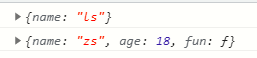
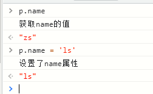

### Object.assign
引用MND的话来说:
> Object.assign() 方法用于将所有可枚举属性的值从一个或多个源对象分配到目标对象。它将返回目标对象。

用我的话来说就是：将一个对象的可枚举属性转移到另一个对象中,这个方法的返回值是转移后的新对象。
**语法：Object.assign(target,source)**
这种转移有以下特性：
* 目标对象（新对象）中的属性如果和源对象（旧对象）中属性相同，则会被覆盖
```javascript
let oldObj = {
  name:'zs'
}
let newObj = {
  name:'ls'
}
Object.assign(newObj,oldObj)
console.log(newObj.name)   //zs
``` 
* 如果目标对象是空的，则可以理解成拷贝，拷贝的是属性值。如果属性值是简单数据类型，则为是深拷贝。
```javascript
let oldObj = {
  name:'zs'
}
let newObj = {}
Object.assign(newObj,oldObj)
console.log(newObj.name)    //zs
oldObj.name = 'ls'
console.log(oldObj.name)    //ls
console.log(newObj.name)    //zs
// 由此可见转移过后，改变原对象中属性值不会影响到新对象，同样新对象属性改变也不会影响原对象
```
* 如果属性值是复杂数据类型，则为浅拷贝。
```javascript
let oldObj = {
  name:'zs',
  depObj: {
    age:18
  }
}
let newObj = {}
Object.assign(newObj,oldObj)
console.log(newObj.depObj.age)    //18
oldObj.depObj.age = 88
console.log(oldObj.depObj.age)    //88
console.log(newObj.depObj.age)    //88
// 由此可见，改变原对象中的复杂数据类型属性会影响到新对象，同样对新对象中复杂数据类型属性进行操作也会影响到原对象
```

既然这个方法可以实现对象的拷贝，就简单说下其他的对象拷贝方法：
1. JSON.stringify和JSON.parse
这两个方法分别是将js对象转换成json字符串和将json字符串解析成js对象，先用`JSON.stringify()`再用`JSON.parse()`可达到和`Object.assign()`一样的拷贝效果，这种方法属于深拷贝，但有以下注意事项：
* 如果json里面有时间对象，则序列化结果：时间对象=>字符串的形式
* 如果json里有RegExp、Error对象，则序列化的结果将只得到空对象 RegExp、Error => {}
* 如果json里有 function,undefined，则序列化的结果会把 function,undefined 丢失
* 如果json里有NaN、Infinity和-Infinity，则序列化的结果会变成null
* 如果json里有对象是由构造函数生成的，则序列化的结果会丢弃对象的 constructor
```javascript
let obj = {
  name: 'zs'
}
let newObj = JSON.parse(JSON.stringify(obj))
console.log(newObj.name)    //zs
obj.name = 'ls'
console.log(obj.name)    //ls
console.log(newObj.name)    //zs
```
1. 使用递归实现深拷贝
对于属性值是复杂数据类型的对象或者数组，都可以使用递归来进行深拷贝，不管数据嵌套多少层都可以
```javascript
 let deepClone = function(old){
 if(old) {
   if(typeof(old) == 'object') {                  //如果拷贝的数据是复杂数据类型
     let newObj = Array.isArray(old) ? [] : {}    //判断是数组还是对象
     for (const key in old) {
       if (old.hasOwnProperty.call(old, key)) {   //不拷贝原型上的属性
         if(typeof(old[key]) == 'object'){        //如果对象或数组的属性是复杂数据类型，则用递归再对属性执行一次函数
           newObj[key] = deepClone(old[key])
         } else {
           newObj[key] = old[key]                 //属性是基本数据类型直接赋值
         }
       }
     }
     return newObj
   } else {                                       //如果拷贝数据是基本数据类型，直接赋值返回
     let newObj = undefined
     return newObj = old
   }
 }
}
// 使用：
let ob = {
  name: 'zs',
  dep:{
    age:18
  }
}
let newOb = deepClone(ob)
console.log(newOb.dep.age)  //18
ob.dep.age = 88
console.log(ob.dep.age)  //88
console.log(newOb.dep.age)  //18
// 由结果可知，成功进行了深拷贝，拷贝后源数据和新数据不会相互影响
```

### Object.create
> 该方法创建一个新对象，使用现有的对象来提供新创建的对象的__proto__
```javascript
let obj1 = {
   name: 'zs',
   age: 18,
   fun: function(){
     console.log("my name is"+" "+this.name);
   }
}
let obj2 = Object.create(obj1)
cosole.log(obj2)
cosole.log(obj2.__proto__)
```
输出结果如下：可以看到，使用`Object.create()`方法第一个参数传入的对象作为了新对象的原型

`Object.create()`可以接受第二个参数，这个参数是可选的，作用是给新创建的对象添加属性
```javascript
let obj2 = Object.create(obj1,{name:{value:'ls',writable:true,enumerable:true,configurable:true}})
console.log(obj2)
console.log(obj2.__proto__);
```
输出结果：

从结果可知，已经成功给新创建的对象添加了一个name属性，值是ls

接下来就说说第二个参数只是添加了个属性为写这么一长串东西
* Object.create()的第二个参数接受一个对象，该对象的属性名作为新创建的对象中的属性名，该对象的属性值为该属性的配置项，也是一个对象
* 配置项对象的value：代表该属性的值
* writable：该属性是否是可修改的。默认为false，所以要手动设置为true
* configurable: 该属性是否是可删除的。也是默认为false
* enumerable：该属性是否是可枚举的。默认为false。比如使用for in去遍历这个对象，enumerable为false的属性就不能被遍历出来。其他还有Object.keys、JSON.stringify、Object.assign等方法都是操作的对象可枚举属性


补充：`Object.create(null)`用以创建一个没有原型的对象
### Object.defineProperties
> 直接在一个对象上定义新的属性或修改现有属性，并返回该对象。接受两个参数，第一个是要操作的对象，第二个是对对象的具体操作，也是个对象

很简单，直接上代码
```javascript
let obj1 = {
  name: 'zs',
  age: 18,
}
console.log("修改之前",obj1);
Object.defineProperties(obj1,{
  name:{
    value:'ls'
  }
})
console.log("修改之后",obj1);
```
这样就成功的修改了obj1对象的name属性值

和上面`Object.create`方法的第二个参数一样，也有writable、configurable、enumerable属性，通过字面量、构造函数、`new Object()`出来的对象这些属性值默认为true
```javascript
Object.defineProperties(obj1,{
  name:{
    value:'ls',
    writable:true,
    configurable:true,
    enumerable:true
  },
  age:{
    value:88
  }
})
```
### Object.defineProperty
> 和Object.defineProperties一样，都是直接在一个对象上定义新的属性或修改现有属性，并返回该对象。

他们的区别是`Object.defineProperty`一次只能对一个属性进行操作。而`Object.defineProperties`可以同时设置对象的多个属性，比如上面同时设置name和age属性
`Object.defineProperty`接受3个参数，第一个是操作的对象，第二个是操作的属性，第三个是对属性的具体操作
ps：如果对属性进行get和set重写，则不能同时设置属性的value，会报错
```javascript
let obj1 = {
  name: 'zs',
  age: 18
}
// 这里要用一个空对象来充当被操作的对象，如果直接传obj1，那么get操作中return的时候又获取了一次对象属性
// 就会再次触发get，这样就会形成死循环，一直会去get
let p = {}
Object.defineProperties(p,"name",{
    get(){
      console.log("获取name的值");
      return obj1.name
    },
    set(val){
      console.log("设置了name属性");
      obj1.name = val
    }
  }
)
```


---